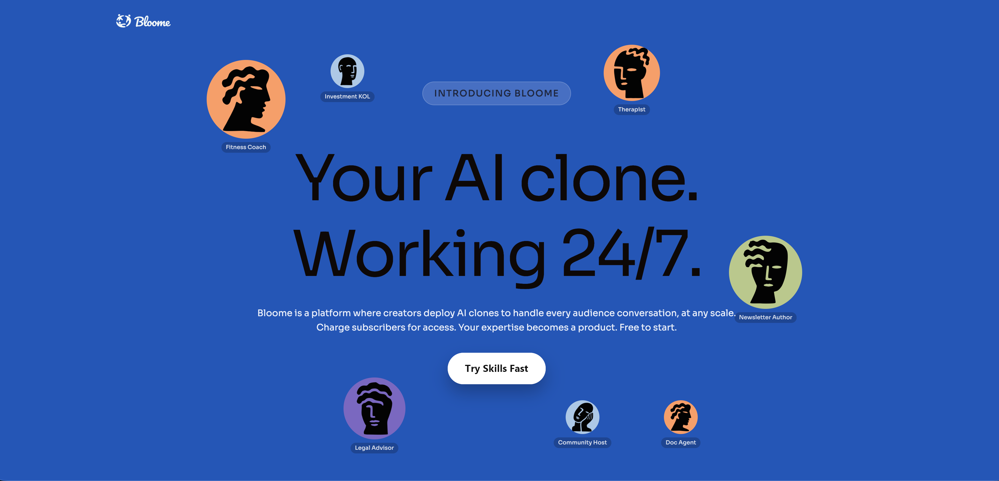

    
  <h1>Awesome Persona Distill Skills</h1>
  

    
  

**_[汉语](./README.md)_**

A curated list of [Agent Skills](https://agentskills.io) centered on people, relationships, commemorative scenes, and methodological perspectives.

Here, "persona distillation" mainly refers to extracting expressive style, decision frameworks, and interaction patterns from conversations, works, materials, or digital traces. It is not assumed to be equivalent to a complete reconstruction of a real individual.

> [!NOTE]
> Entries are sorted by repository name for easier maintenance and lookup. The order does not imply recommendation priority, quality, or importance.

<a href="https://www.star-history.com/?repos=xixu-me%2Fawesome-persona-distill-skills&type=date&legend=top-left">
 <picture>
   <source media="(prefers-color-scheme: dark)" srcset="https://api.star-history.com/chart?repos=xixu-me/awesome-persona-distill-skills&type=date&theme=dark&legend=top-left" />
   <source media="(prefers-color-scheme: light)" srcset="https://api.star-history.com/chart?repos=xixu-me/awesome-persona-distill-skills&type=date&legend=top-left" />
   
 </picture>
</a>

## Want to try skills without setup? Try Bloome

[Bloome](https://bloome.im/agent/join/l7BU8Y4m?ref=lS4ObZC6&from=poster) lets you skip local installation and configuration: add any skill from this list as an agent to a chat with one click, then talk to it directly. If you like it, share it with others or invite it into a group, with zero setup. If you want to try the skills in this list one by one, Bloome is the fastest way to do it.

## Table of Contents

- [Self Distillation and Meta Tools](#self-distillation-and-meta-tools)
- [Workplace and Academic Relationships](#workplace-and-academic-relationships)
- [Intimate Relationships and Family Memories](#intimate-relationships-and-family-memories)
- [Public Figures and Methodological Perspectives](#public-figures-and-methodological-perspectives)
- [Spiritual and Specialized Topics](#spiritual-and-specialized-topics)
- [Contributing](#contributing)

## Self Distillation and Meta Tools

- [Bazi Person Skill](https://github.com/cantian-ai/bazi-persona-skill) - Generate an AI persona from Bazi (Chinese astrology) that talks, feels, and evolves over time.
- [curator.skill](https://github.com/Aar0nPB/curator-skill) - Cross-author persona skill router — matches user intent to the best-fit persona from 30 skills.
- [数字人生.skills](https://github.com/wildbyteai/digital-life) - Distills a structured self-portrait from the digital traces a person leaves across everyday tools.
- [Forge Skill](https://github.com/YIKUAIBANZI/forge-skill) - Separates self-distillation and other-persona distillation into distinct workflows for reflection, memory preservation, and persona-driven dialogue.
- [永生.skill](https://github.com/agenmod/immortal-skill) - Distills a multidimensional digital persona profile from chat logs and related materials.
- [master-skill](https://github.com/swaylq/master-skill) - Distills how practitioners in a given industry judge, decide, and use tools into a reusable methodological skill.
- [midas.skill](https://github.com/realteamprinz/midas-skill) - Extracts a 6-dimension wealth operating system from any public figure (money engine, deal architecture, investment thesis, risk profile, leverage model, exit pattern), and mines personal daily data for wealth signals.
- [anti-distill](https://github.com/lcmomo/my-anti-distill) - Separates publicly distributable skill content from private experience backups for skill-delivery workflows.
- [数字生命开源计划](https://github.com/weixr18/my-digital-life) - Provides a framework for turning a personal knowledge base into a digital avatar.
- [Nuwa](https://github.com/alchaincyf/nuwa-skill) - Distills reusable skills from an individual's mental models, decision heuristics, and expression patterns.
- [Persona Skill](https://github.com/Tomsawyerhu/Persona-Skill) - Unified multilingual persona distillation, synthesis, role-playing, and management.
- [Skill Fidelity Bench](https://github.com/c0ffee-milk/skill-fidelity-bench) - Benchmarks whether a modified or poisoned persona-distill skill preserves the clean skill's capabilities, reasoning, boundaries, and distinctiveness.
- [VibePortrait](https://github.com/dadwadw233/VibePortrait) - Distills a developer portrait, development skills, and preferences from vibe-coding conversations.
- [Yourself.skill](https://github.com/notdog1998/yourself-skill) - Organizes personal conversations and records into a self-distillation assistant.
- [zhuzi-skill](https://github.com/linzzzzzz/zhuzi-skill) - Orchestrates structured debates among existing persona skills around the same question, with automatic persona selection, round-based exchanges, and neutral synthesis.

## Workplace and Academic Relationships

- [boss.skill](https://github.com/vogtsw/boss-skills) - Distills a manager's judgment criteria, review style, and communication expectations from work materials.
- [colleague.skill](https://github.com/titanwings/colleague-skill) - Organizes a former colleague's work context, habits, and communication style from team materials.
- [HR.skill](https://github.com/Schlaflied/hr-skill) - Organizes HR communication logic and decision patterns from rejection letters and hiring processes for reverse-engineering screening criteria and reframing a job-seeking narrative.
- [大学老师.skill](https://github.com/CommitHu502Craft/professor-skill) - Organizes review priorities, exam patterns, and grading cues from course materials and a professor's style.
- [roast-cold-email-skill](https://github.com/Schlaflied/roast-cold-email-skill) - Organizes a critical job-outreach style from public company information and hiring materials for evidence-based cold emails.
- [Senpai.skill](https://github.com/zhanghaichao520/senpai-skill) - Distills how senior lab members mentor others and handle emergencies from research group materials.
- [Mentor.skill](https://github.com/ybq22/supervisor) - Organizes a supervisor's advising style into a mentor assistant for students and educators.

## Intimate Relationships and Family Memories

- [brother.skill](https://github.com/realteamprinz/brother-skill) - Distill your bros (working for real brothers, group chat friends, and internet personalities) from YouTube, TikTok, Discord, WeChat and more — their voice, catchphrases, humor style, and chaos energy.
- [Crush.skill](https://github.com/xiaoheizi8/crush-skills) - Distills conversational style from chats, photos, and social traces for reflection and emotional recollection.
- [ex.skill](https://github.com/therealXiaomanChu/ex-skill) - Organizes speaking style and shared memories from private records for remembrance and reflection.
- [MamaSkill](https://github.com/jiangziyan-693/MamaSkill) - Organizes chat logs, letters, and voice notes from a loved one into a commemorative family companion.
- [父母.skill](https://github.com/xiaoheizi8/parents-skills) - Distills parents' tone, habits, and family memories from personal materials.
- [恋爱训练营.skill](https://github.com/TammyTan516/relationship-training-skill) - Simulates a crush's communication style from chat history so users can practice expression, invitations, and repair conversations in a safe sandbox.
- [Reunion Skill](https://github.com/yangdongchen66-boop/reunion-skill) - Builds a locally runnable commemorative companion assistant from the digital relics of deceased relatives or friends.

## Public Figures and Methodological Perspectives

- [AI 维舟.skill](https://github.com/TerryTian-tech/AIWeiZhou-skill) - Distill Wei Zhou's mindset and thought framework on social issues, and develop a reusable methodological perspective for analyzing hot topics or evaluating specific viewpoints.
- [Buffett Perspective - Claude Code Skill](https://github.com/will2025btc/buffett-perspective) - Distills Warren Buffett's investment and decision-making frameworks into a reusable methodological perspective.
- [常熟阿诺（加州盛亦陶） Skill](https://github.com/Ricardo-Vv/changshu-anuo) - Distills Changshu Anuo's "left-brain versus right-brain" analytical perspective into a reusable methodological framework.
- [陈泽.skill](https://github.com/fisher-yu-like/chenze-skill) - Anchor host Chen Ze’s thinking operating system， analyzing your problems using Chen Ze’s cognitive framework.
- [马斯克.skill](https://github.com/alchaincyf/elon-musk-skill) - Distills Elon Musk's first-principles thinking and product mindset into a reusable decision framework.
- [峰哥亡命天涯 Skill](https://github.com/rottenpen/fengge-wangmingtianya-perspective) - Distills the "Fengge Wangming Tianya" style into a reality-first, stop-loss-oriented, darkly humorous methodological perspective.
- [费曼.skill](https://github.com/alchaincyf/feynman-skill) - Distills Richard Feynman's explanatory style and truth-seeking heuristics into a reusable methodological framework.
- [郭德纲.skill](https://github.com/ByteRax/guodegang-skills) - Distills Guo Degang's expressive structure, practical judgment, and career methods into a reusable methodological perspective.
- [户晨风.skill](https://github.com/Janlaywss/hu-chenfeng-skill) - Distills Hu Chenfeng's consumer-realist perspective for analyzing spending, cities, and career choices.
- [Ilya.skill](https://github.com/alchaincyf/ilya-sutskever-skill) - Distills Ilya Sutskever's judgment on scaling, research breakthroughs, and superintelligence into a reusable methodological perspective.
- [Justin Bieber ·Skill](https://github.com/fisher-yu-like/justin-bieber-skill) - Justin Bieber's thinking operating system — engaging in conversation with you through his experiences and creative work.
- [Karl Marx Skill](https://github.com/youaifuou/karl-marx-skill) - Distilled from 17 of Marx's original texts, surfacing his critical framework and dialectical method, with dual output modes for casual dialogue and scholarly analysis.
- [KarlMarx Skill](https://github.com/baojiachen0214/karlmarx-skill) - Distills structural analysis, contradiction analysis, and practice-based verification methods from Marxist methodology into a framework for deep problem analysis.
- [Karpathy.skill](https://github.com/alchaincyf/karpathy-skill) - Distills Andrej Karpathy's thinking on AI engineering, education, and research into a reusable methodological perspective.
- [liangxi-skills](https://github.com/1sh1ro/liangxi-skills) - Distills Liangxi's structural trade reading, risk habits, and Chinese trading voice from publicly indexed X posts and trade replays into a reusable methodological perspective.
- [luxun skill](https://github.com/youaifuou/luxun-skill) - Distilled from Lu Xun's 305 collected works and Xu Shoushang's chronological biography, surfacing his ironic prose, "deceit-and-self-deceit" critique and detached observational frame.
- [MaoZedong.skill](https://github.com/wwwaapplleecu-source/mao-skill) - Distills Mao Zedong's thought framework and methodological perspective from publicly available writings.
- [毛选.skill](https://github.com/leezythu/maoxuan-skill) - Distills contradiction analysis, base-building thinking, and strategic judgment frameworks from Mao's selected works into a reusable methodological perspective.
- [Mises Method Skill](https://github.com/LijiayuDeng/mises-perspective) - Distills Ludwig von Mises's praxeology, economic calculation, and critique of interventionism into a reusable methodological lens for political economy and institutional analysis.
- [MrBeast.skill](https://github.com/alchaincyf/mrbeast-skill) - Distills MrBeast's methods for content concepts, packaging, and audience retention into a reusable creator playbook.
- [芒格.skill](https://github.com/alchaincyf/munger-skill) - Distills Charlie Munger's interdisciplinary mental models and decision heuristics into a reusable methodological framework.
- [纳瓦尔.skill](https://github.com/alchaincyf/naval-skill) - Distills Naval's frameworks on wealth, leverage, and judgment into a reusable methodological perspective.
- [PG.skill](https://github.com/alchaincyf/paul-graham-skill) - Distills Paul Graham's frameworks on startups, writing, and independent thinking into a reusable methodological perspective.
- [求是 Skill](https://github.com/HughYau/qiushi-skill) - Organizes fact-seeking, investigation, and strategic-judgment tools from related methodology into a reusable analytical framework.
- [RobPike.skill](https://github.com/smallnest/rob-pike-skill) - Distills Rob Pike's technical judgment and expressive style on Unix, Go, and engineering design into a reusable methodological perspective.
- [内娱.skill](https://github.com/yanghaoraneve/star-skill) - Organizes a singer's or idol's expressive style and fan-facing interaction patterns from lyrics, videos, posts, and comments into a conversational digital persona assistant.
- [乔布斯.skill](https://github.com/alchaincyf/steve-jobs-skill) - Distills Steve Jobs's product judgment, narrative style, and decision heuristics into a reusable methodological framework.
- [塔勒布.skill](https://github.com/alchaincyf/taleb-skill) - Distills Nassim Taleb's heuristics on antifragility and risk into a reusable methodological framework.
- [童锦程.skill](https://github.com/hotcoffeeshake/tong-jincheng-skill) - Distills Tong Jincheng's blunt heuristics for reading relationships and interpersonal dynamics.
- [特朗普.skill](https://github.com/alchaincyf/trump-skill) - Distills Donald Trump's frameworks for negotiation, anchoring, and power analysis into a reusable methodological perspective.
- [王二.skill](https://github.com/fisher-yu-like/wang-er-skill) - Refine the spirit and way of thinking of the character 'Wang Er' in Wang Xiaobo's works to form a reusable methodological framework.
- [X 导师.skill](https://github.com/alchaincyf/x-mentor-skill) - Integrates the writing and growth playbooks of multiple social-platform creators into a unified mentor-style methodological skill.
- [新青年.Skill](https://github.com/SamadhiFire/xinqingnian-skill) - Invite the "most capable brain in New China" to serve as a "temporary advisor" for a period of time. Condense 157 articles from "Selected Works of Mao" and transform its methodology into an executable practical analysis skill.
- [张一鸣.skill](https://github.com/alchaincyf/zhang-yiming-skill) - Distills Zhang Yiming's product, organizational, and strategic judgment frameworks into a reusable methodological perspective.
- [张雪峰.skill](https://github.com/alchaincyf/zhangxuefeng-skill) - Distills Zhang Xuefeng's practical frameworks for education planning, exams, and career planning into a reusable methodological perspective.
- [zizek-skill](https://github.com/JikunR/zizek-skill) - Organizes a Zizekian mode of analysis around interrogating presuppositions, tracking desire, and exposing contradictions into a reusable analytical tool.

## Spiritual and Specialized Topics

- [赛博算命 Skill](https://github.com/jinchenma94/bazi-skill) - Organizes Four Pillars charting and analysis from birth information and traditional destiny texts.
- [DiamondSutra.skill](https://github.com/dull-bird/diamond-sutra-skill) - Organizes teaching frameworks for the Diamond Sutra from the text and related interpretations into a conversational specialized skill.
- [堪舆子](https://github.com/voidforall/fengshui.skill) - Distills traditional feng shui methods — flying stars, eight mansions, and date selection — from classical texts into a skill with the persona of a seventh-generation Jiangnan geomancy master.
- [Master-skill](https://github.com/xr843/Master-skill) - Organizes Han Chinese Buddhist teaching styles and explanatory perspectives based on Buddhist canonical literature.
- [Numerologist Skills (AI 术数工程化)](https://github.com/FANzR-arch/Numerologist_skills) - Uses structured references and scripted constraints to organize Qimen Dunjia, Ziwei Doushu, and related metaphysics practices.
- [月老·姻缘测算 Skills](https://github.com/Ming-H/yinyuan-skills) - Organizes relationship divination into a multi-mode traditional metaphysics skill for matching, fortune sticks, and romance-luck readings.

## Contributing

For new inclusion requests, please start with the issue form. After a maintainer reviews the request and adds the `approved` label, the workflow will generate a pull request automatically.

If you are fixing existing entries, documentation, or broken links, you can still open a pull request directly. See [`CONTRIBUTING.en.md`](CONTRIBUTING.en.md) for the full process.
